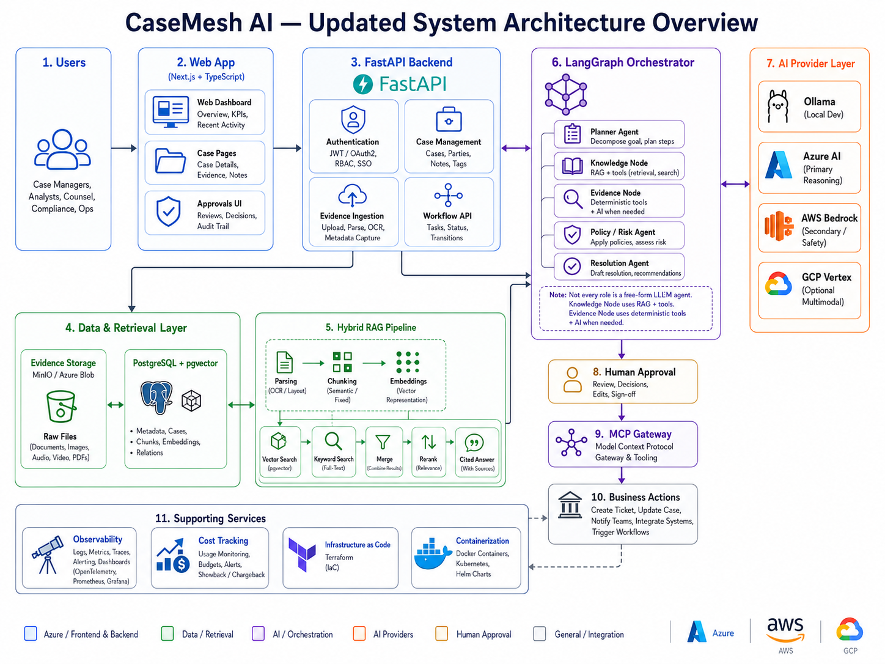

# CaseMesh AI

> **Status:** Repository foundation complete. Implementation begins in the next milestone.

CaseMesh AI is a production-oriented, full-stack, agentic AI case investigation and resolution platform.  
It is designed to combine **hybrid RAG**, **structured agent orchestration**, **deterministic tools**, **human approval**, **MCP-based business actions**, and **multi-cloud AI providers** while remaining **local-first and zero-cost-first** during development.

## What CaseMesh AI is designed to do

A user creates a case, uploads evidence, and starts an AI-assisted investigation. CaseMesh AI then:

1. Ingests and validates evidence.
2. Indexes documents for semantic and lexical retrieval.
3. Uses hybrid RAG to retrieve grounded evidence with citations.
4. Orchestrates focused reasoning roles with LangGraph.
5. Uses deterministic tools for calculations and structured operations.
6. Produces a cited resolution draft.
7. Requires human approval before sensitive or write-side actions.
8. Executes approved integrations through an MCP gateway.
9. Records audit, observability, evaluation, and cost data.

## Design principles

- **Local-first:** most development runs locally with Docker, PostgreSQL, pgvector, MinIO, and Ollama.
- **Zero-cost-first:** cloud services are enabled only when they add measurable value.
- **Hybrid retrieval:** vector similarity + PostgreSQL full-text search + merge + rerank.
- **Focused orchestration:** not every logical role is a free-form autonomous agent.
- **Deterministic where possible:** calculations and routine transformations belong in code.
- **Human-in-the-loop:** financial, write-side, or high-impact actions require approval.
- **Provider abstraction:** Ollama, Azure AI, AWS Bedrock, and optional GCP Vertex are accessed behind a common provider layer.
- **Traceability:** every recommendation should be grounded in evidence and citations.
- **Operational visibility:** model calls, tool calls, latency, errors, token use, and estimated cost are observable.

## Planned technology stack

### Frontend
- Next.js
- TypeScript

### Backend
- Python 3.12
- FastAPI
- Pydantic
- SQLAlchemy
- Alembic

### AI & orchestration
- LangGraph
- Ollama / Qwen3 8B for local development
- Azure AI as primary cloud reasoning provider
- AWS Bedrock as secondary / safety-oriented provider
- GCP Vertex as optional multimodal provider

### Data
- PostgreSQL
- pgvector
- PostgreSQL Full-Text Search
- MinIO locally
- Azure Blob Storage in cloud validation

### Platform & operations
- Docker / Docker Compose
- Terraform
- GitHub Actions
- OpenTelemetry
- Azure Application Insights / local tracing
- Cost tracking and budget guardrails

## High-level architecture



## Hybrid RAG


## Orchestrated workflow


## Repository structure

```text
casemesh-ai/
├── apps/
│   ├── api/                    # FastAPI backend (next milestone)
│   └── web/                    # Next.js frontend (later milestone)
├── packages/
│   └── shared/                 # Shared schemas/types/contracts
├── infrastructure/
│   ├── docker/                 # Docker-related configuration
│   └── terraform/              # Cloud Infrastructure as Code
├── data/
│   ├── raw/                    # Local raw data; ignored by Git
│   ├── synthetic/              # Synthetic CaseMesh dataset location
│   └── evaluation/             # Evaluation / ground-truth data
├── docs/
│   ├── architecture/
│   │   └── adr/                # Architecture Decision Records
│   └── images/                 # Architecture diagrams
├── scripts/                    # Windows setup and validation scripts
├── tests/                      # Cross-project tests
├── .github/                    # GitHub templates
├── .env.example
├── .gitignore
├── ARCHITECTURE.md
├── ROADMAP.md
├── CONTRIBUTING.md
├── SECURITY.md
└── LICENSE
```

## Dataset placement

Place the downloaded **CaseMesh AI Dataset v1.0** inside:

```text
data/synthetic/casemesh-ai-dataset-v1.0/
```

The repository intentionally does **not** include private, large, or sensitive datasets by default.

## Current milestone

### M0 — Repository Foundation ✅
- Architecture decisions documented
- Repo structure prepared
- Security and contribution rules prepared
- Environment verification script prepared
- Architecture diagrams included
- Dataset location prepared

### Next milestone
**M1 — FastAPI Backend Foundation**

The next implementation milestone will create:

- Python 3.12 virtual environment
- FastAPI application
- configuration layer
- structured logging
- `/health` endpoint
- pytest setup
- Ruff
- mypy
- Docker-ready backend foundation

## Documentation

- [Architecture](ARCHITECTURE.md)
- [Roadmap](ROADMAP.md)
- [Contribution Guide](CONTRIBUTING.md)
- [Security Policy](SECURITY.md)
- [GitHub Setup](docs/GITHUB_SETUP.md)
- [Development Setup](docs/DEVELOPMENT_SETUP.md)
- [Project Checklist](docs/PROJECT_CHECKLIST.md)

## License

MIT License. See [LICENSE](LICENSE).
