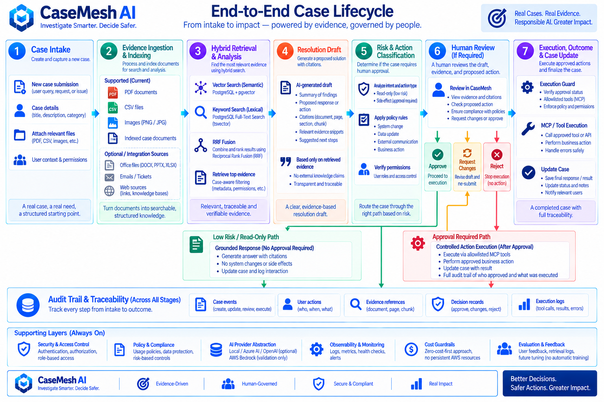
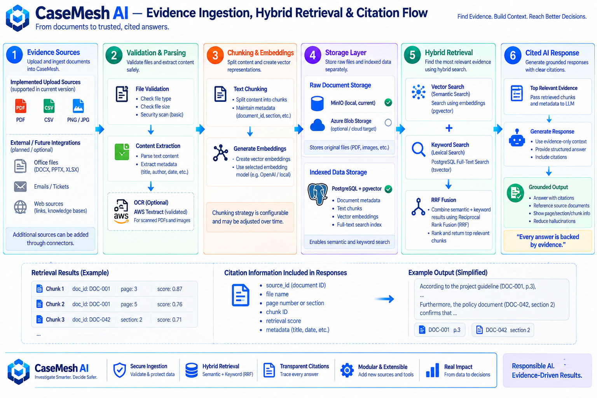
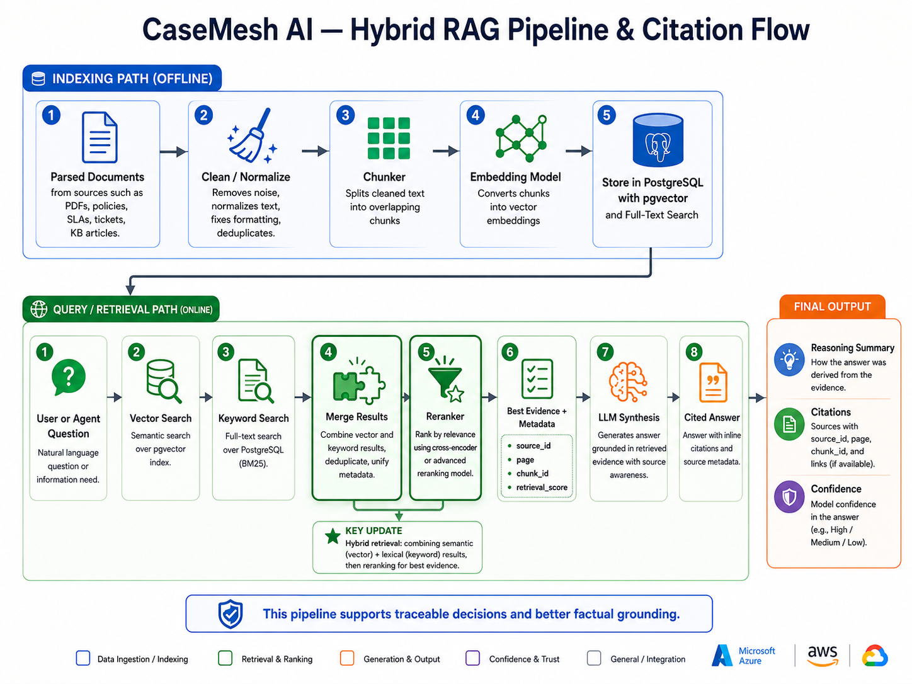
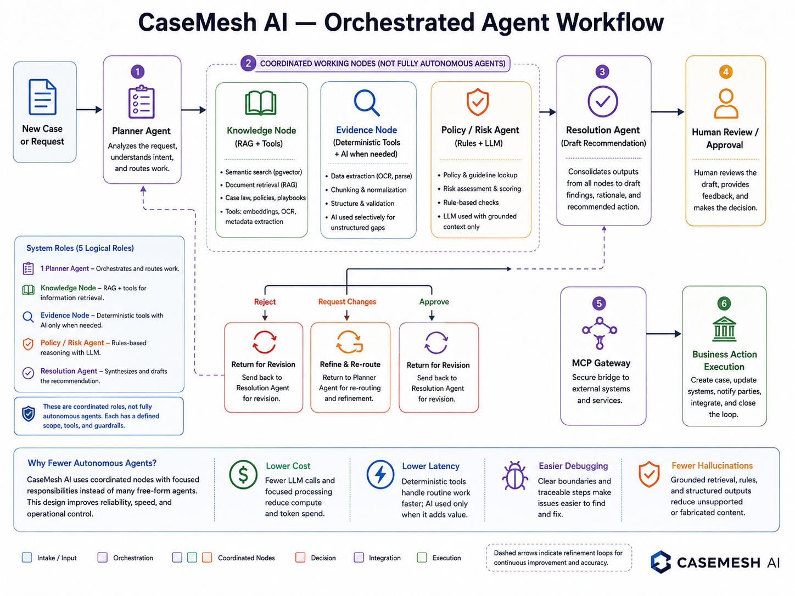
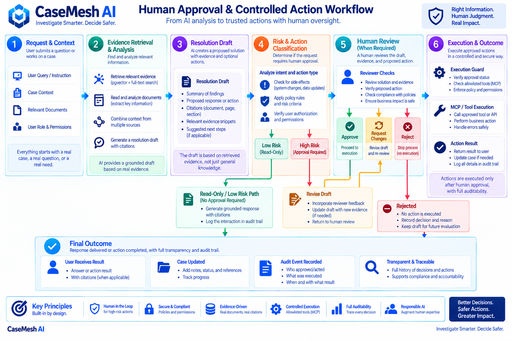
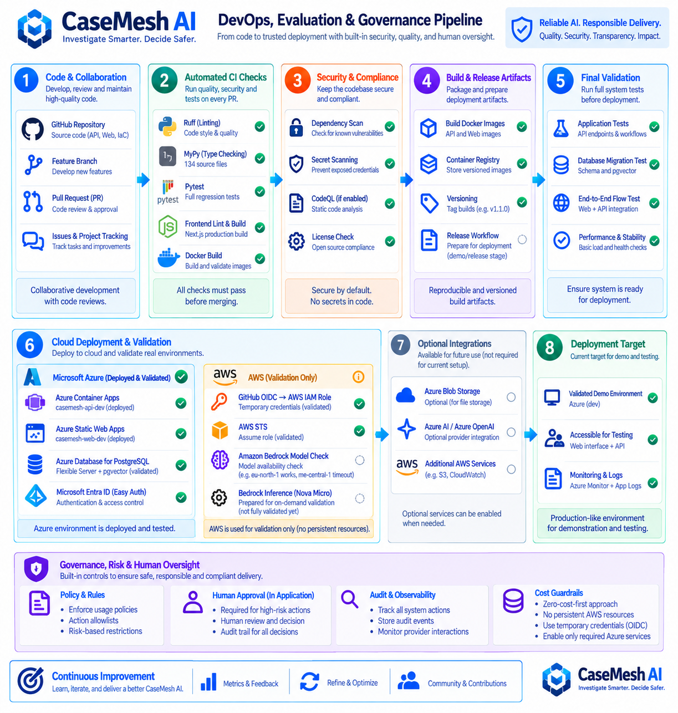
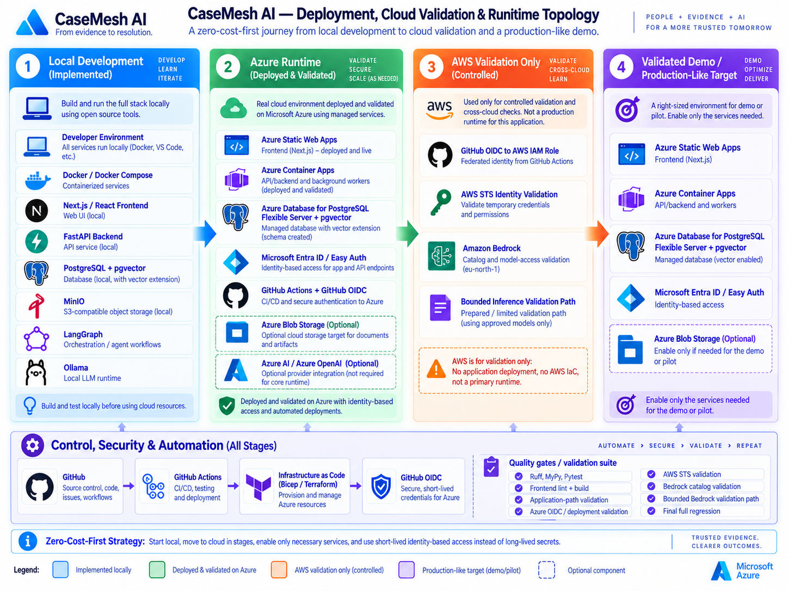

# CaseMesh AI

> **Status:** Core platform operational. Azure dev deployment, hardened CI/CD, MCP integration, and AWS Intelligence v1.1 validation are complete.

**CaseMesh AI** is a full-stack AI case investigation and resolution platform built around one principle:

> **AI should help people reach evidence-backed decisions without gaining unrestricted control over sensitive actions.**

The platform combines evidence ingestion, hybrid RAG, source-aware answers, coordinated AI workflows, deterministic tools, human-in-the-loop approval, MCP-based integrations, evaluation, cloud deployment, and explicit operational guardrails.

---

## Why CaseMesh AI

CaseMesh is designed for workflows where answers must be **traceable, reviewable, and safe to act on**.

A case can move through:

1. case intake and evidence upload,
2. validation, parsing, chunking, and indexing,
3. semantic + lexical retrieval,
4. grounded answer or resolution-draft generation,
5. policy and risk checks,
6. human approval when an action has side effects,
7. controlled MCP/tool execution,
8. audit logging and evaluation.

The system deliberately separates **read-only reasoning** from **write-side execution**.

---

## Current implementation status

### Implemented in the application

- case and document APIs,
- document ingestion and validation,
- chunking and embeddings,
- PostgreSQL + pgvector storage,
- PostgreSQL full-text search,
- hybrid retrieval with Reciprocal Rank Fusion (RRF),
- citation-aware grounded answers,
- investigation workflows,
- policy and risk guardrails,
- approval routing and approval state,
- action execution boundaries,
- MCP server/client integration,
- evaluation datasets, metrics, stability, and artifacts,
- provider abstraction for local/cloud-compatible AI execution,
- extensive automated test coverage.

### Deployed and validated on Azure

- React + Vite frontend on **Azure Static Web Apps**,
- FastAPI backend on **Azure Container Apps**,
- Microsoft Entra ID / Easy Auth for protected API access,
- GitHub Actions deployment workflows,
- GitHub OIDC federation to Azure,
- Azure Bicep infrastructure definitions,
- immutable API container deployment through GHCR,
- readiness verification and API rollback logic.

The cloud deployment consumes an existing PostgreSQL database connection through a secure `DATABASE_URL` input rather than provisioning the database directly in the current Bicep stack.

### AWS integration status

AWS is a **controlled validation / secondary-intelligence boundary**, not the primary runtime.

The repository contains implementation and tests for:

- GitHub OIDC federation to AWS,
- temporary federated AWS credentials,
- AWS identity validation,
- temporary S3 staging and lifecycle controls,
- SQS-based asynchronous processing,
- SNS alerting,
- Textract document-intelligence integration,
- Bedrock second-review and guardrail adapters,
- cross-cloud failure and security boundaries.

The AWS GitHub workflow uses short-lived OIDC credentials and validates the assumed AWS identity. AWS cloud usage is intentionally opt-in, bounded, and designed to avoid permanent infrastructure or long-lived static credentials.

### AWS validation status

Real cloud and regression validation completed:

- GitHub OIDC to AWS IAM using short-lived credentials,
- Bedrock catalog validation,
- one bounded real Bedrock inference,
- the real CaseMesh second-review application path through Bedrock,
- offline fail-safe validation for provider, guardrail, alert, risk, and policy failures,
- final API/Web/Platform regression after the AWS integration.

Normal CI does not call Bedrock. Real AWS model calls remain manual and bounded.

See [AWS Intelligence v1.1](docs/AWS_INTELLIGENCE_V1_1.md) for the validation record and security boundaries.
### AI provider reality

The current core provider factories implement:

- **Ollama** for local embeddings and generation,
- **Hugging Face** for embeddings and generation.

The Azure dev configuration uses Hugging Face-compatible providers by default, while Ollama remains the main local-development path.

Azure AI / Azure OpenAI and other future providers are architectural extension points, not required core runtime dependencies in the current implementation.

---

## System architecture

```text
Users
  |
  v
React + Vite + TypeScript
Azure Static Web Apps
  |
  | Microsoft Entra ID / MSAL
  v
FastAPI / Python 3.12
Azure Container Apps
  |
  +--> Case Management
  +--> Evidence Ingestion
  +--> Hybrid Retrieval
  +--> Grounded Answers
  +--> Investigation Workflows
  +--> Policy / Risk Guardrails
  +--> Human Approval
  +--> MCP / Controlled Execution
  +--> Evaluation
  |
  +--------------------------+
  |                          |
  v                          v
PostgreSQL + pgvector      AI Providers
+ Full-Text Search         - Ollama (local)
                           - Hugging Face
  |
  v
Evidence + Metadata + Citations

AWS validation / intelligence boundary
  |
  +--> OIDC / STS
  +--> Temporary S3 staging
  +--> SQS / SNS
  +--> Textract
  +--> Bedrock review / guardrails
```

### Architecture overview



---

## Core domain

CaseMesh models a case as a traceable container for evidence, investigation state, resolution drafts, decisions, actions, and audit events.

The design keeps evidence and operational decisions connected so an answer can be traced back to its source material and an executed action can be traced back to its authorization path.

[Open the Core Domain Model](docs/images/casemesh_ai_core_domain_model.png)

---

## Evidence ingestion and retrieval

Evidence moves through a structured pipeline:

```text
Upload
  |
  v
Validate / Parse
  |
  v
Chunk
  |
  v
Embed
  |
  v
PostgreSQL + pgvector
  |
  +--> Semantic Search
  |
  +--> PostgreSQL Full-Text Search
             |
             v
        RRF Fusion
             |
             v
   Ranked Evidence Chunks
             |
             v
       Grounded Context
             |
             v
    Answer / Resolution Draft
```

CaseMesh does **not** rely on a single retrieval method. Semantic and lexical results are fused with **Reciprocal Rank Fusion (RRF)** before evidence is supplied to generation.

Retrieved results preserve document/chunk metadata so citations remain traceable.





---

## Grounded answers

Generated answers are built from retrieved evidence rather than unrestricted model context.

The grounding layer is designed to preserve:

- document identity,
- chunk identity,
- page or section context when available,
- retrieval scores,
- source metadata,
- citations used in the final answer.

This supports explainability without pretending that retrieval scores are model-confidence scores.

---

## Orchestrated AI workflow

CaseMesh uses coordinated logical roles rather than a swarm of unrestricted autonomous agents.

The workflow separates:

- planning,
- knowledge retrieval,
- evidence processing,
- policy and risk evaluation,
- deterministic tools,
- resolution generation,
- approval routing,
- action execution.

Read-only tasks can progress automatically when policy allows. Side-effecting or high-risk actions remain behind explicit application controls.



---

## Human approval and controlled actions

The execution model distinguishes between two paths.

### Read-only / low-risk

```text
Evidence
  -> Analysis
  -> Grounded Response
  -> Audit
```

### Approval-required / side-effecting

```text
Evidence
  -> Resolution Draft
  -> Risk / Policy Check
  -> Human Review
       |
       +--> Approve --------> Execution Guard -> Allowlisted Tool -> Result
       |
       +--> Request Changes -> Revise Draft -> Review Again
       |
       +--> Reject ----------> Stop Execution -> Record Decision
```

The Azure runtime defaults reinforce this design:

```text
ACTION_EXECUTION_ENABLED=false
ACTION_EXECUTION_MODE=dry_run
```

Live execution is allowlisted rather than generally available.



---

## MCP integration

CaseMesh includes an MCP integration boundary for controlled tools and external actions.

The implementation includes:

- MCP server,
- MCP client,
- authentication,
- HTTP and stdio transports,
- case-reading tools,
- evidence-retrieval tools,
- authorization checks,
- integration with investigation workflows.

MCP is used as a **controlled tool boundary**, not as a replacement for normal internal application functions.

---

## Provider abstraction

The application separates provider contracts from provider implementations.

### Current core providers

**Generation**
- Ollama
- Hugging Face

**Embeddings**
- Ollama
- Hugging Face

This keeps the application logic independent from one model vendor while still requiring explicit adapters and configuration for each provider.

AWS Bedrock is implemented separately as a controlled review/validation integration rather than as the primary generation factory.

[Open the Provider Abstraction diagram](docs/images/casemesh_ai_provider_abstraction_layer.png)

---

## AWS intelligence and validation layer

The `apps/api/src/casemesh/integrations/aws/` package isolates AWS-specific capabilities from the primary application path.

Implemented areas include:

```text
AWS Identity
  |
  +--> Federated credentials
  +--> GitHub OIDC validation
  |
  +--> Temporary evidence staging
  |      +--> S3
  |      +--> lifecycle / cleanup
  |
  +--> Async processing
  |      +--> SQS
  |      +--> SNS notifications
  |
  +--> Document intelligence
  |      +--> Textract
  |
  +--> Secondary AI review
         +--> Bedrock review
         +--> Bedrock guardrails
         +--> second-review gating
```

The design keeps AWS optional, bounded, testable, and outside the primary runtime dependency chain.

### GitHub OIDC to AWS

The manual AWS validation workflow:

- requires `main`,
- requires explicit `VALIDATE_AWS` confirmation,
- requests `id-token: write`,
- assumes an AWS IAM role using GitHub OIDC,
- uses a short-lived STS session,
- validates the resulting AWS caller identity,
- does not depend on long-lived AWS access keys.

---

## Evaluation

CaseMesh includes a dedicated evaluation subsystem rather than treating model output as correct by default.

The evaluation package covers:

- evaluation datasets,
- metrics,
- SLA-oriented evaluation,
- stability checks,
- artifact generation,
- provenance,
- API exposure for evaluation results.

Versioned evaluation artifacts are stored under:

```text
data/evaluation/
```

The repository includes a `baseline-sla-v1` evaluation set with results, summaries, failures, run history, and stability artifacts.

---

## Technology stack

### Frontend

- React 19
- TypeScript
- Vite
- Microsoft Authentication Library (MSAL)
- Oxlint

### Backend

- Python 3.12
- FastAPI
- Pydantic
- SQLAlchemy
- Alembic
- PostgreSQL
- pgvector
- pytest
- Ruff
- MyPy

### AI / retrieval / orchestration

- Ollama
- Hugging Face inference
- embeddings
- retrieval-augmented generation
- PostgreSQL Full-Text Search
- pgvector semantic retrieval
- Reciprocal Rank Fusion
- coordinated investigation workflows
- MCP

### Cloud and delivery

- Docker
- Docker Compose
- Azure Container Apps
- Azure Static Web Apps
- Microsoft Entra ID
- Azure Bicep
- GitHub Container Registry
- GitHub Actions
- GitHub OIDC with Azure
- GitHub OIDC with AWS
- AWS STS
- optional AWS S3 / SQS / SNS / Textract / Bedrock integrations

---

## CI and quality gates

### API CI

Validates:

- dependency integrity,
- Ruff,
- MyPy,
- pytest.

### Web CI

Validates:

- reproducible installation with `npm ci`,
- Oxlint,
- production Vite build.

### Platform CI

Validates:

- Docker Compose configuration,
- API image build,
- non-root container execution,
- expected container working directory,
- Azure CLI availability,
- Azure Bicep compilation.

### AWS validation

A dedicated manual workflow validates GitHub OIDC federation to AWS using short-lived credentials and STS identity verification.



---

## Deployment model

Cloud deployment is intentionally conservative.

### API deployment

The API deployment workflow:

1. requires `main`,
2. requires explicit `DEPLOY` confirmation,
3. builds the API image,
4. publishes an immutable GHCR image tagged with the Git commit SHA,
5. authenticates to Azure using GitHub OIDC,
6. updates the Azure Container App,
7. waits for the expected revision,
8. verifies `/health/ready`,
9. verifies the deployed revision/image,
10. rolls back if deployment verification fails.

Container images use immutable references:

```text
ghcr.io/mohamadktich/casemesh-api:<git-sha>
```

### Frontend deployment

The frontend workflow:

1. requires `main`,
2. requires explicit `DEPLOY` confirmation,
3. installs with `npm ci`,
4. runs linting,
5. creates the production Vite build,
6. validates the configured API endpoint,
7. deploys the prebuilt app to Azure Static Web Apps,
8. verifies the deployed site.

### Deployment topology



---

## Authentication and security

The deployed Azure application uses Microsoft Entra ID.

The frontend authenticates through MSAL, while Azure Container Apps authentication protects API access. Public health/readiness endpoints remain available for operational checks.

Security practices include:

- minimum GitHub workflow permissions,
- actions pinned to immutable SHAs,
- `persist-credentials: false`,
- OIDC instead of stored Azure/AWS cloud credentials,
- secrets excluded from source control,
- secure Bicep parameters,
- immutable API image tags,
- explicit deployment confirmations,
- execution defaults set to disabled / dry-run,
- allowlisted write actions,
- post-deployment health verification,
- API rollback behavior,
- audit-oriented execution flows.

---

## Zero-cost-first strategy

CaseMesh is intentionally designed so meaningful development does not require permanently paid infrastructure.

The project favors:

- local-first development,
- open-source models and components,
- Dockerized local infrastructure,
- Ollama for local inference,
- free tiers where useful,
- scale-to-zero cloud compute,
- small dev resource limits,
- manual deployments,
- bounded cloud validation,
- temporary identity-based cloud credentials,
- no requirement for persistent AWS infrastructure.

The goal is to prove real cloud integration without turning a portfolio project into a monthly invoice generator.

---

## Local development

### Prerequisites

Recommended:

- Python 3.12
- Node.js / npm
- Docker Desktop
- Docker Compose
- Ollama
- Git

Azure CLI and AWS CLI are only required for the corresponding cloud-validation workflows.

### 1. Clone and configure

```powershell
git clone https://github.com/MohamadKtich/casemesh-ai.git
cd casemesh-ai

Copy-Item .env.example .env
```

Review `.env.example` before adding any local credentials.

### 2. Prepare Ollama

The local stack is configured for:

```text
Generation: qwen3:8b
Embeddings: nomic-embed-text
```

Example:

```powershell
ollama pull qwen3:8b
ollama pull nomic-embed-text
ollama list
```

### 3. Start PostgreSQL and the API

```powershell
docker compose up --build
```

The default local API port is:

```text
http://localhost:8000
```

### 4. Start the frontend

In a second terminal:

```powershell
cd apps\web
npm ci
npm run dev
```

Use `apps/web/.env.example` for the frontend API/auth configuration expected by your environment.

---

## Azure dev environment

The current README-tracked dev endpoints are:

```text
Frontend
https://zealous-pebble-08744c900.5.azurestaticapps.net

API
https://casemesh-api-dev.lemonwater-0bb11448.uaenorth.azurecontainerapps.io

API readiness
https://casemesh-api-dev.lemonwater-0bb11448.uaenorth.azurecontainerapps.io/health/ready
```

This environment exists for development validation and portfolio demonstration. It is **not** presented as a production-SLA environment.

---

## Repository structure

```text
casemesh-ai/
|
+-- apps/
|   +-- api/
|   |   +-- src/casemesh/
|   |   |   +-- api/
|   |   |   +-- embeddings/
|   |   |   +-- evaluation/
|   |   |   +-- execution/
|   |   |   +-- grounding/
|   |   |   +-- ingestion/
|   |   |   +-- integrations/aws/
|   |   |   +-- intelligence/
|   |   |   +-- llm/
|   |   |   +-- mcp/
|   |   |   +-- policy/
|   |   |   +-- repositories/
|   |   |   +-- services/
|   |   |   +-- workflows/
|   |   +-- tests/
|   |
|   +-- web/                     # React + Vite + TypeScript
|
+-- data/
|   +-- evaluation/
|   +-- reference/
|   +-- synthetic/
|
+-- docs/
|   +-- architecture/
|   +-- images/
|
+-- infrastructure/
|   +-- azure/                   # Active Bicep infrastructure
|
+-- scripts/
|
+-- .github/
|   +-- workflows/
|       +-- api-ci.yml
|       +-- api-deploy-dev.yml
|       +-- aws-oidc-validate.yml
|       +-- platform-ci.yml
|       +-- web-ci.yml
|       +-- web-deploy-dev.yml
|
+-- ARCHITECTURE.md
+-- CONTRIBUTING.md
+-- ROADMAP.md
+-- SECURITY.md
+-- README.md
```

---

## Architecture diagrams

The repository includes ten documentation views, each focused on a different concern:

- [Core Domain Model](docs/images/casemesh_ai_core_domain_model.png)
- [Deployment & Cloud Validation Topology](docs/images/casemesh_ai_deployment_topology.png)
- [DevOps, Evaluation & Governance Pipeline](docs/images/casemesh_ai_devops_evaluation_governance_pipeline.png)
- [Evidence Ingestion, Hybrid Retrieval & Citation Flow](docs/images/casemesh_ai_evidence_flow_infographic.png)
- [Human Approval & Controlled Action Workflow](docs/images/casemesh_ai_human_approval_workflow.png)
- [Hybrid RAG Pipeline & Citation Flow](docs/images/casemesh_ai_hybrid_rag_pipeline.png)
- [End-to-End Case Lifecycle](docs/images/casemesh_ai_lifecycle_flowchart.png)
- [Orchestrated Agent Workflow](docs/images/casemesh_ai_orchestrated_workflow_diagram.png)
- [Provider Abstraction Layer](docs/images/casemesh_ai_provider_abstraction_layer.png)
- [Updated System Architecture Overview](docs/images/casemesh_ai_updated_system_architecture_overview.png)

---

## Documentation

- [Architecture](ARCHITECTURE.md)
- [Security Policy](SECURITY.md)
- [Contribution Guide](CONTRIBUTING.md)
- [Roadmap](ROADMAP.md)
- [GitHub Setup](docs/GITHUB_SETUP.md)
- [Development Setup](docs/DEVELOPMENT_SETUP.md)
- [Project Checklist](docs/PROJECT_CHECKLIST.md)
- [Architecture Diagram Index](docs/architecture/DIAGRAMS.md)

Phase-level implementation notes are also available under `docs/`.

---

## Engineering principles

- **Evidence first:** answers should be grounded in retrievable source material.
- **Deterministic where possible:** structured work belongs in code, not unnecessary model calls.
- **Human governed:** sensitive actions remain under explicit approval and policy control.
- **Provider aware, not provider locked:** model providers sit behind explicit interfaces.
- **Least privilege:** cloud identities and workflow permissions are intentionally constrained.
- **Fail safe:** missing permissions, unavailable providers, or failed validation must not silently become write access.
- **Observable:** audit state, evaluation artifacts, deployment verification, and health checks are part of the design.
- **Zero-cost-first:** cloud features must justify their cost and remain optional for normal local development.

---

## Project positioning

CaseMesh AI is an engineering portfolio project demonstrating practical work across:

- AI engineering,
- hybrid RAG,
- agentic workflow design,
- human-in-the-loop systems,
- MCP,
- evaluation,
- backend engineering,
- frontend integration,
- PostgreSQL + vector search,
- authentication and authorization,
- cloud architecture,
- Infrastructure as Code,
- containerization,
- CI/CD,
- AWS/Azure identity federation,
- deployment safety,
- security-oriented software design.

The project is intentionally not a technology checklist. Its purpose is to show how modern AI capabilities can be integrated into a **controlled, testable, deployable, evidence-driven software system**.

---

## License

MIT License. See [LICENSE](LICENSE).
